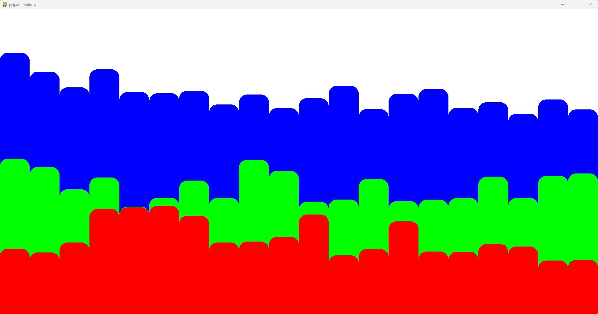
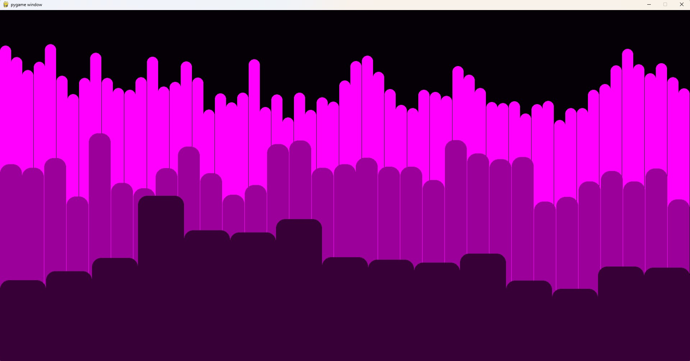
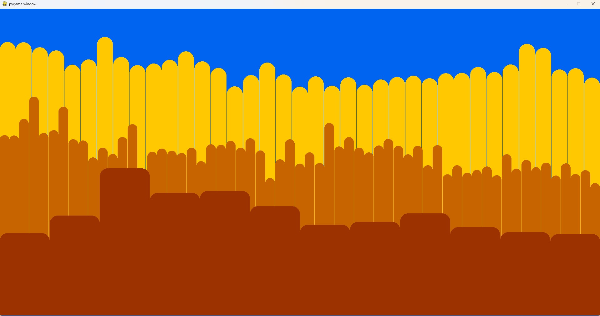
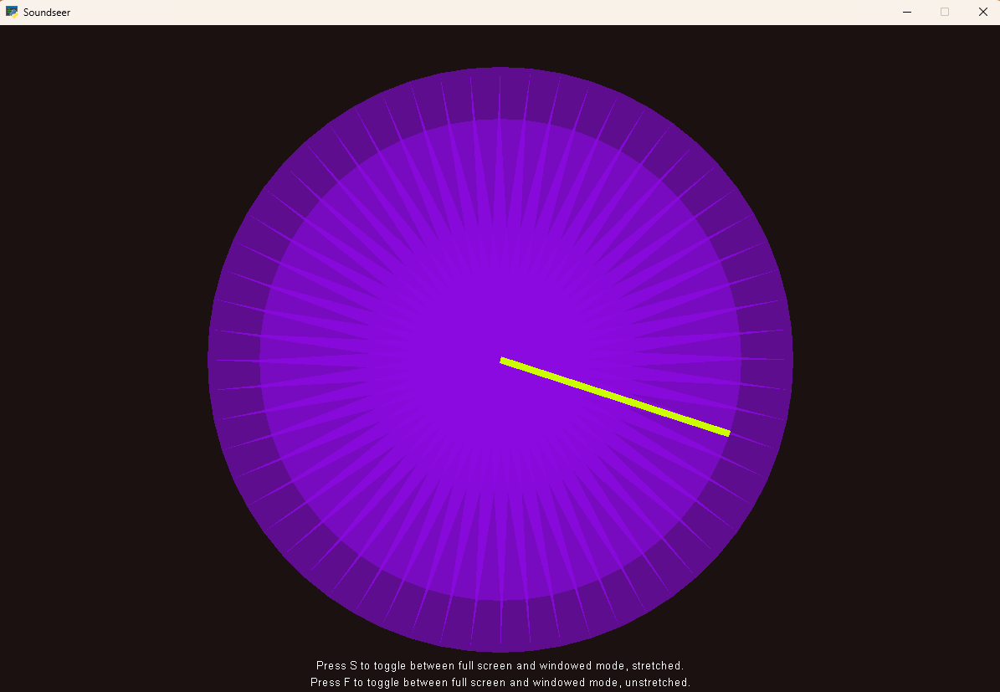
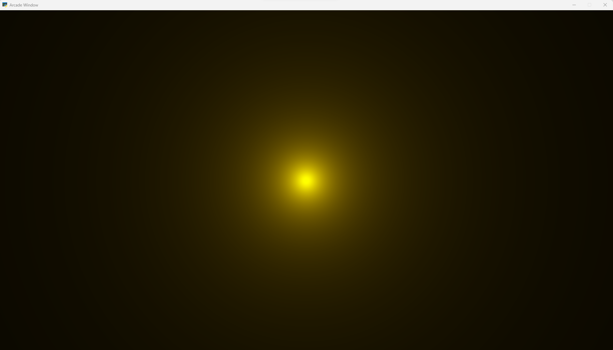

# Soundseer 
### By Addison Wurtz

***

## Description 
Soundseer is a music visualizer that uses librosa to analyze sound files and create custom animations for mp3 files. 
Soundseer includes visualizers from pygame and python arcade. 

The "bouncing bars" visualizer uses a spectrogram for each animation frame. The amplitude of various frequency "buckets" 
are then animated in the form of three audio bars--representing the bass, mid, and treble frequencies. Each audio bar
has a configurable number of frequency bars. Additionally, all the colors are configurable.

While working on my first animation, it became clear that pygame offered fairly limited options for expansion. After 
some searching I came across python arcade. It has much more visually complex rendering capabilities and build in tools.

I built my second visualizer in python arcade using librosa's beat and note detection tools. It is repsonsive, but 
becomes overly frenetic and strobing for fast songs. One of my demo commands for this visualizer is a 60 bpm metronome.
Under those conditions I find it quite pleasant. 

While reading the python arcade documentation, I came across shaders for the first time. Unfortunately, I wasn't able to 
do much with these. The paradigm shift was just too much for me to wrap my mind around this late in the term. But, I 
wish I had discovered shaders earlier because they can definitely produce the kinds of results that I had in mind when I
set out on this project. 

## Pygame Examples
I've included some screenshots along with the commands to generate that configuration. There are example 
songs in the repository to ensure that these commands will run out-of-the-box.

### Default:
The only required parameter is a mp3 file:

```
python bouncingbars.py Songs\Moby-Porcelain.mp3
```


### Shades of purple with custom number of frequency bars:
```
python bouncingbars.py Songs\DietMountainDewInstrumental.mp3 --bass_bars 15 --mid_bars 30 --treble_bars 60 --bass_color 55,0,55 --mid_color 155,0,155 --treble_color 255,0,255 --background_color 5,0,5     
```


### Playing with colors and number of bars:
```
python bouncingbars.py Songs\MKDomDolla-RhymeDust.mp3 --bass_bars 12 --mid_bars 60 --treble_bars 36 --bass_color 155,50,0 --mid_color 200,100,0 --treble_color 255,200,0 --background_color 0,100,240                                   
```



## Python Arcade Examples

### Beat Radar:
My python arcade visualizer takes a mp3 file as an argument.
I used librosa to detect the beat and intensity of the pulses. The speed of the radar needle is determined by the 
song's detected beats per minute, and the color and size of the background circle are determined by the intensity of
each pulse.

```
python radar_visualizer.py Songs\60BPM.mp3
```
```
python radar_visualizer.py Songs\DietMountainDewInstrumental.mp3
```



### Shader:
The shader demo takes a mp3 file as an arguement.

Unfortunately, this is as far as I got with my shader. It makes a glowing orb that pulses and changes color with the 
detected beat of a song. I am very excited to do more with shaders in the future, and I wish I would have known about 
them at the start of the term!
```
python shader.py Songs\DietMountainDewInstrumental.mp3
```



***


## Dependencies
Soundseer uses librosa, pygame, Python Arcade, PyGame, and NumPy

`pip install librosa`

`pip install pygame`

`pip install arcade`

`pip install numpy`

***

## Roadmap

- Keys to notes visualizer using colors for notes and a shader for animation 
- Make some kind of transforming or fractalizing shader animation 
- Make a side-scrolling animation?

***

## References 
[Music Visualizer Tutorial](https://gitlab.com/avirzayev/medium-audio-visualizer-code/-/blob/master/main.py)

[Arcade Radar Tutorial](https://api.arcade.academy/en/stable/examples/radar_sweep.html#radar-sweep)

## License
[MIT License](/LICENSE.md)